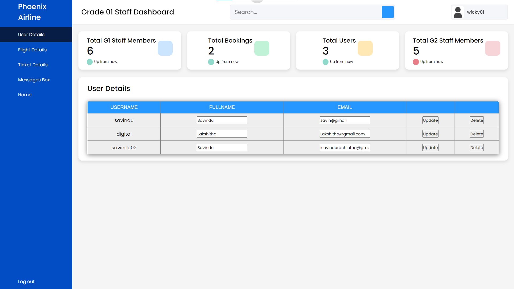
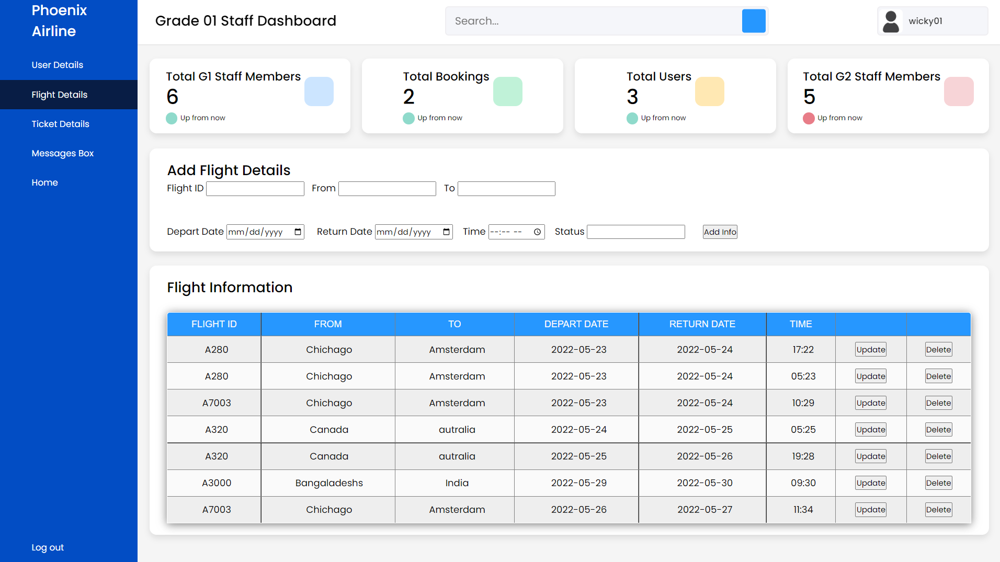
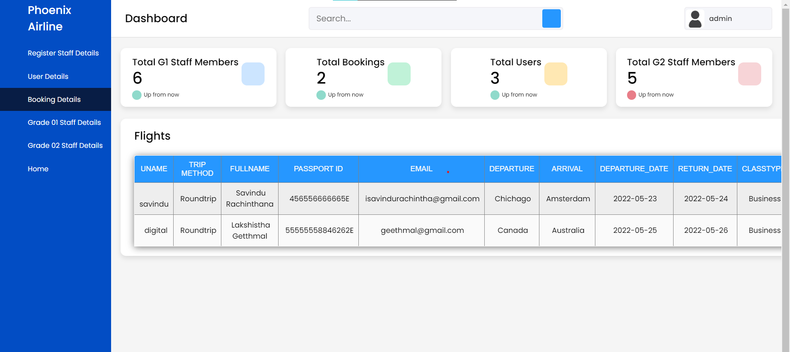

# Phoenix Airline PVT 

 

Web-based fully responsive Flight Booking System for Phoenix Airline based on the Model View Controller (MVC) Architecture made using Java Servlets and Java Server Pages. Moreover, authentication and authorization for users are implemented using GlassFish Roles. The web application is also secured against SQL Injection and Cross-Site Scripting attacks.

***Phoenix Airline PVT is an airline with a small online flight booking system.  So the application has ticket booking and many more facilities,***
* <a href="https://drive.google.com/file/d/10-pO-u18cYkmEB5Dl4CirgBcydHggm-S/view?usp=sharing">System Preview video</a>
* <a href="https://drive.google.com/file/d/1Z-QOtPUB-BeIS2IWo5aYbIEYxN5avdzv/view?usp=sharing">Project File</a>

# Technologies Used

* **Frontend**: HTML, CSS, JavaScript, Jquery, Bootstrap, Java Server Pages (JSPs)
* **Backend**: Java Servlets, Java Models, mySQL (Database)
* **Security Features**: SQL Injection, Cross-Site Scripting (XSS), Glassfish roles

# Roles

* Public Customer 
* Airline Staff
* Airline Admin 

# Workflow (Functionalities)

Phoenix-Airline is a multifunctional web application that customers can use to book a flight and search & find flights without booking a ticket. 

Following are the steps of work flow:

1. Airline Admin will add & can approve the airline management staff.
2. There are two types of staff categories:

   Staff members need to register on the system using the staff registration form, and Staff can log in using a registered    email password after the admin approves and selects the staff grade. 
      * Grade one Staff (G1)
          - G1 Staff can view, update and delete user information & flight section, and booking section 
      * Grade two Staff (G2)
          - G2 Staff can view information and only add new flight details
3. Public users can't enter the system without registration on the system, so the user needs to register and log in using the registered user name and email. 

4. After login into the system public user can book a ticket for a flight, and without booking user can search or find flight details like arrival and departure date/time and user can view the reserved ticket list in the profile section and also can update profile details & contact the airline management to clarify anything about Phoenix-Airline
   
5. Ticket Booking procedure 
   The user needs to select the type (compulsory)
      * Return trip
      * One Way
      
   The airline system has three flight ticket categories 
      * Economical 
      * Business
      * First Class

   A single per user can book flight tickets for up to 10 people. 
      * 18+ Adult 
      * 17- Chilled 

6. Find Flight procedere 
   user can find the booked flights or without booking user can view flight details and find. There is two types for find      flight
      * Find flight using Tikect ID
      * Find flight selecting From/To

# How to run

1- Install these:

* Java SE Development Kit 8 (JDK 8)
* After installing JDK 8, install NetBeans IDE with all the features including GlassFish Server.

2. Create database: phoenix_airline_db (use this name)
3. Import the SQL files to **phoenix_airline_db** database using PhpMyAdmin - <a href="SQL - Database/phoenix_airline_db.sql">SQL</a>
4. Download and unzip the project and open it in Netbeans: <a href="https://drive.google.com/file/d/1Z-QOtPUB-BeIS2IWo5aYbIEYxN5avdzv/view?usp=sharing">Project File</a>
5. Web application admin Login Details 
   * username: admin 
   * password: admin123

# Interface - Public user

* Registrations 

* Login

* Home Page - user's Dashboard 

* Book a flight
 

* Flight Status

* Profile

# Interface - Staff

* Staff Dashboard & User Account

* flights

# Interface - Admin

* Login

* Admin Dashboard 
   

